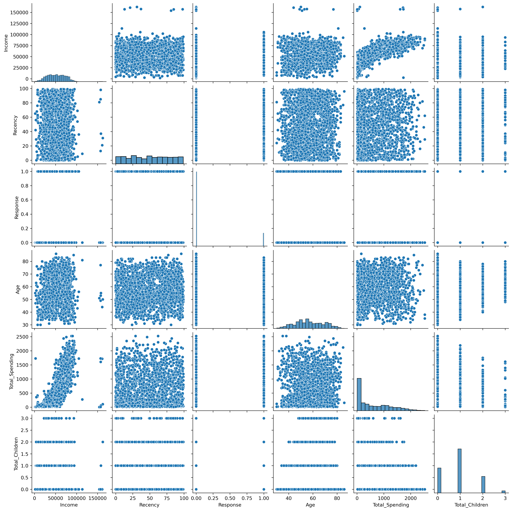
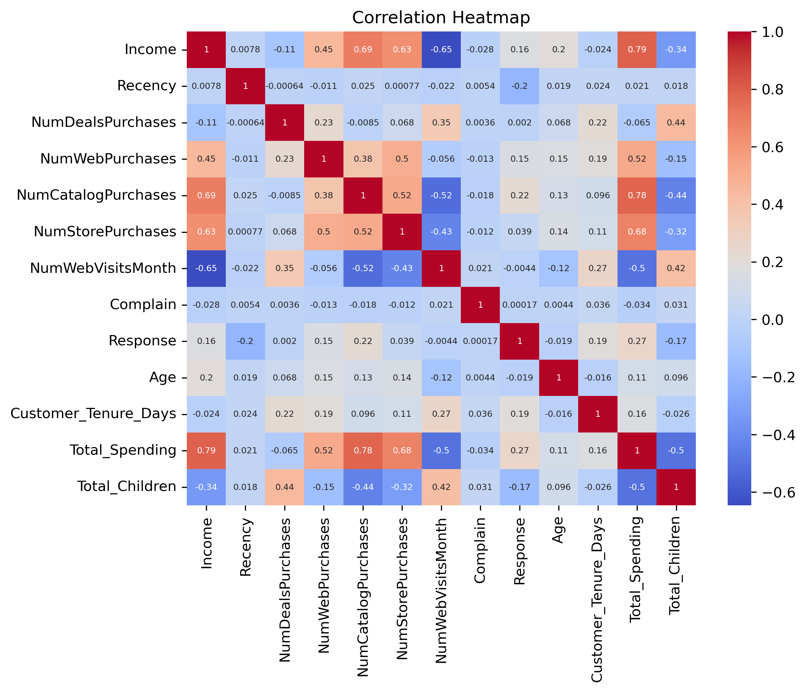
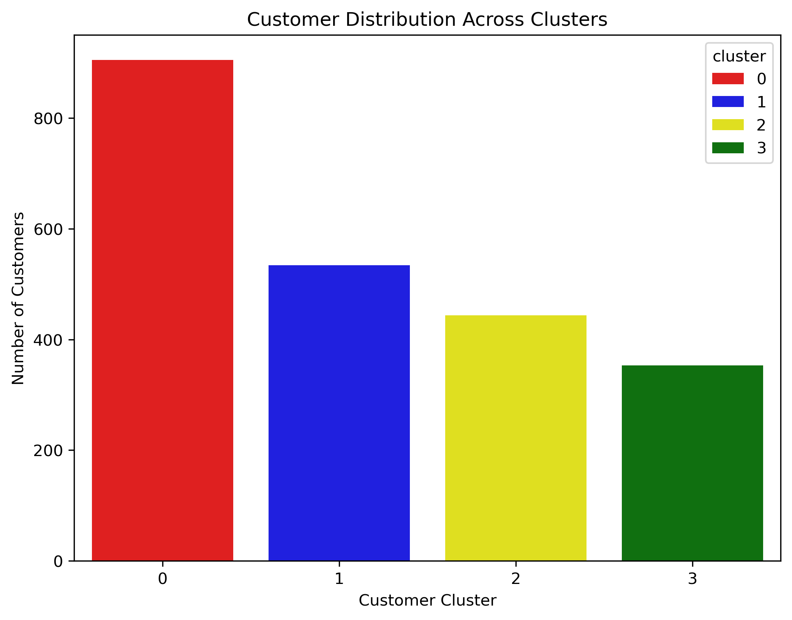
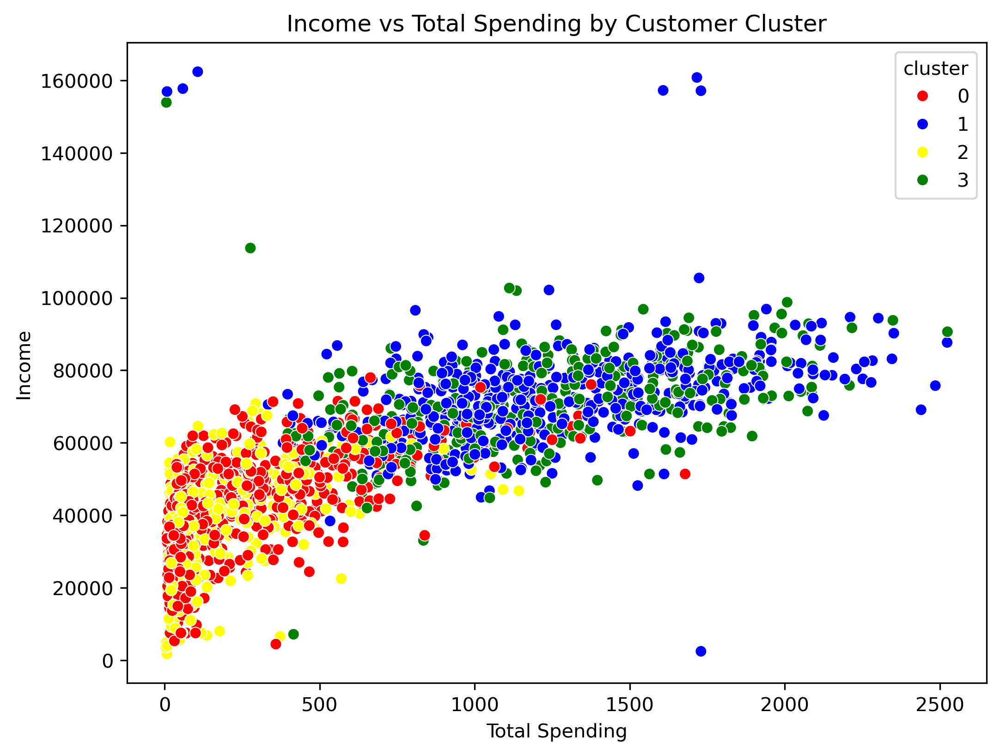

# 🛒 SmartCart Customer Segmentation

An unsupervised machine learning project that segments e-commerce customers into meaningful groups based on purchasing behaviour, customer engagement, demographics, and loyalty indicators.

---

## 📌 Project Overview

SmartCart is a growing e-commerce platform with customer data containing **2,240 customer records and 22 attributes** covering demographics, purchasing behaviour, website activity, and customer response.

The objective of this project is to discover hidden patterns in customer behaviour and group customers into meaningful segments using **unsupervised machine learning**.

These customer segments can help businesses design more personalised marketing campaigns, improve customer engagement, and support customer retention strategies.

---

## 🎯 Problem Statement

SmartCart currently uses generic marketing and engagement strategies without clearly understanding different customer behaviour patterns.

This can result in:

- Inefficient marketing strategies
- Missed opportunities to retain high-value customers
- Difficulty identifying different customer behaviour patterns
- Delayed identification of customers requiring targeted engagement

To solve this problem, an intelligent customer segmentation system is developed using clustering algorithms.

---

## 🧠 Machine Learning Workflow

```text
Customer Dataset
       ↓
Data Cleaning
       ↓
Feature Engineering
       ↓
Outlier Removal
       ↓
Categorical Encoding
       ↓
Feature Scaling
       ↓
PCA Dimensionality Reduction
       ↓
Cluster Evaluation
       ↓
K-Means Clustering
       ↓
Agglomerative Clustering
       ↓
Customer Segmentation
       ↓
Business Insights
```

---

## 📊 Dataset

The original dataset contains:

- **2,240 customers**
- **22 attributes**

The dataset contains information related to:

### 👤 Customer Demographics

- ID
- Year_Birth
- Education
- Marital_Status
- Income
- Kidhome
- Teenhome
- Dt_Customer

### 🛍️ Purchase Behaviour

- MntWines
- MntFruits
- MntMeatProducts
- MntFishProducts
- MntSweetProducts
- MntGoldProds

### 🌐 Purchase Frequency & Website Activity

- NumDealsPurchases
- NumWebPurchases
- NumCatalogPurchases
- NumStorePurchases
- NumWebVisitsMonth

### 📢 Customer Feedback

- Recency
- Complain

---

# 🔧 Data Preprocessing

The following preprocessing steps were performed:

- Checked the dataset structure
- Checked missing values
- Handled missing `Income` values
- Converted `Dt_Customer` into date format
- Created additional customer features
- Removed unnecessary columns
- Detected and removed extreme values
- Encoded categorical variables
- Standardized numerical features

After preprocessing and outlier removal, the dataset contained **2,236 customers and 18 features**.

---

# ⚙️ Feature Engineering

Several new features were created to better understand customer behaviour.

- **Age** – calculated from year of birth
- **Customer Tenure** – number of days since the customer joined SmartCart
- **Total Spending** – total amount spent across product categories
- **Total Children** – combined number of children and teenagers
- **Living With** – grouped customers into `Alone` and `Partner`
- **Education** – simplified education categories

---

# 📈 Exploratory Data Analysis

## 1. Customer Feature Pair Plot

The pair plot is used to understand relationships between important customer features.



## 2. Correlation Heatmap

The correlation heatmap shows relationships between numerical customer features.



---

# 🔬 Dimensionality Reduction

## PCA

Principal Component Analysis (PCA) was used to reduce the dimensionality of the processed dataset.

The first three principal components explain approximately **44.56% of the total variance**.

### 3D PCA Projection


---

# 🔍 Finding the Optimal Number of Clusters

## 1. Elbow Method

The Within-Cluster Sum of Squares (WCSS) was calculated for different values of K.


The Elbow Method indicates **K = 4** as the selected number of clusters.

## 2. Silhouette Score

Silhouette scores were calculated for different values of K to evaluate cluster separation.


## 3. Combined Cluster Evaluation


### Selected Number of Clusters

```text
Optimal K = 4
```

---

# 🤖 Clustering

Two clustering algorithms were explored.

## K-Means Clustering


## Agglomerative Hierarchical Clustering


---

# 👥 Customer Segments

The final clustering analysis identified **4 customer segments**.

| Cluster | Customer Pattern | Key Characteristics |
|---|---|---|
| **Cluster 0** | Family / discount-oriented customers | More children, lower spending, partner households, higher web visits |
| **Cluster 1** | High-value customers | High income and high spending |
| **Cluster 2** | Lower-value customers | Lower income and lower spending |
| **Cluster 3** | High-value / premium customers | High income, high spending and strong purchasing behaviour |

---

# 📊 Cluster Distribution

The distribution of customers across the four clusters is shown below.



---

# 💰 Income vs Spending

The relationship between customer income and total spending is visualized below.



---

# 🏆 Final Results

The final outcome of the SmartCart project is a **4-segment customer classification** based on customer behaviour.

The final customer profiles identified in the analysis are:

### 🔴 Cluster 0 — Family / Discount-Oriented Customers

- More children
- Lower spending
- Partner households
- Higher website visits
- More price-sensitive behaviour

### 🔵 Cluster 1 — High-Value Customers

- High income
- High spending
- Strong purchasing behaviour
- Valuable customer segment

### 🟡 Cluster 2 — Lower-Value Customers

- Low income
- Low spending
- Lower overall customer value
- Suitable for targeted engagement strategies

### 🟢 Cluster 3 — High-Value / Premium Customers

- High income
- High spending
- Strong purchasing behaviour
- Represents an important premium customer segment

### Final Customer Segmentation Visualization


> **Note:** The final visualization above is the presentation of the project outcome and customer segment interpretation. The cluster colours shown in the visualization are used for visual identification of the four customer groups.

---

# 💼 Business Value

The segmentation can help SmartCart:

- 🎯 Create personalised marketing campaigns
- 💰 Identify high-value customers
- 🛍️ Understand purchasing behaviour
- 📢 Improve promotional targeting
- 🔄 Develop customer retention strategies
- 📊 Identify different customer engagement patterns
- 🌐 Understand website and purchasing-channel behaviour

Instead of applying the same marketing strategy to every customer, SmartCart can develop different strategies for each customer segment.

---

# 🛠️ Technologies Used

- Python
- Pandas
- NumPy
- Matplotlib
- Seaborn
- Scikit-learn
- K-Means Clustering
- Agglomerative Clustering
- PCA
- StandardScaler
- One-Hot Encoding
- Jupyter Notebook

---


# 🚀 Future Improvements

- Develop an interactive Streamlit dashboard
- Add automatic customer segment recommendations
- Compare additional clustering algorithms
- Add DBSCAN clustering
- Deploy the model as a web application
- Allow new customers to be automatically assigned to a segment
- Generate personalised marketing recommendations for each cluster

---

# 👩‍💻 Author

**Arpita Wadekar**

Electronics & Communication Engineering Student

**Skills:** Python | AI/ML | Data Analytics

---

⭐ If you find this project useful, consider giving the repository a star!
